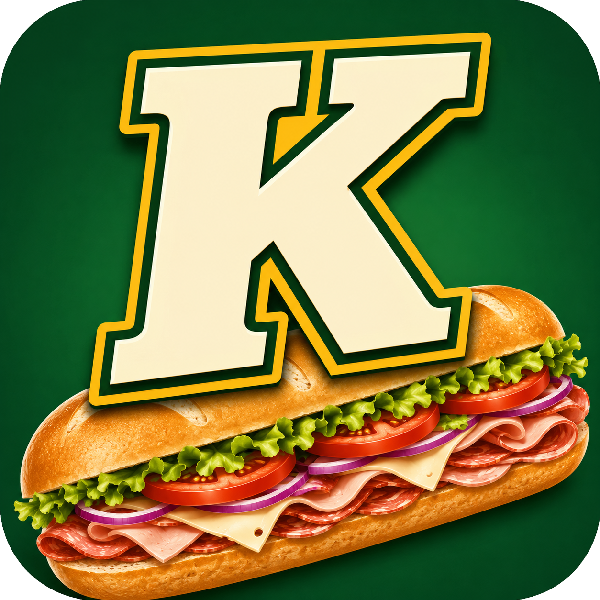

# Sub-K-Very-Small-Web-Server

Sub-K is a Win32 static web server in 932 bytes. Features include requested file serving, index.htm default routing, basic MIME type support, and thread-per-client concurrent connections. Default port is 8080.

Sub-K compiles with MASM and Crinkler. The build for this presentation is set at 932 bytes exe using 11.7 MB of RAM at run time. These are configurable. The source code history also offers "stages". If, for example, you want a much smaller exe with less features, you can build version sbk_017 for a single connection, single html page server in 657 bytes.

If that isn't small enough for you, try version sbk_014 which has hard-coded "hello" and comes in at 552 bytes. The exe size will grow/shrink byte-for-byte as you put in your custom text.

## What is the point of this?

I just wanted to. It's fun.
